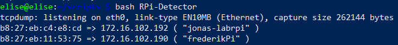
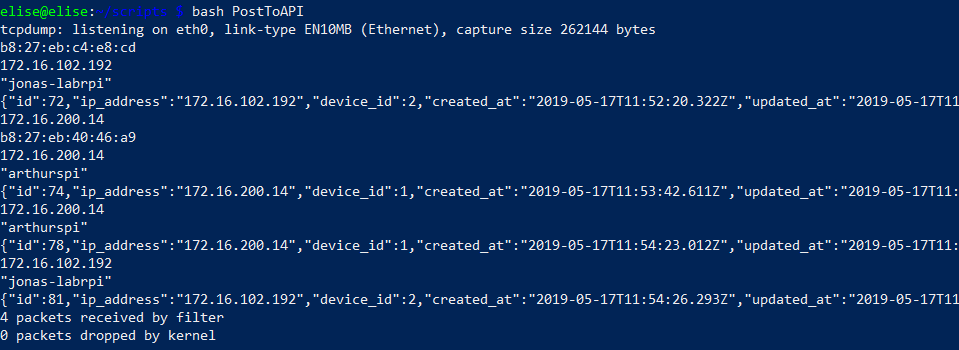
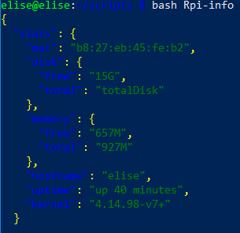
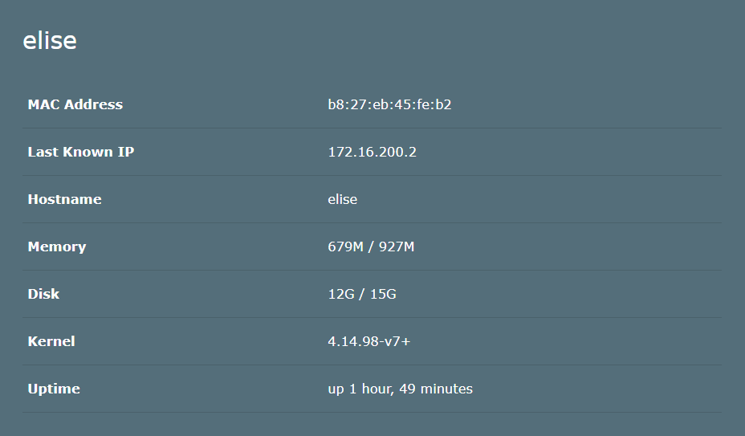
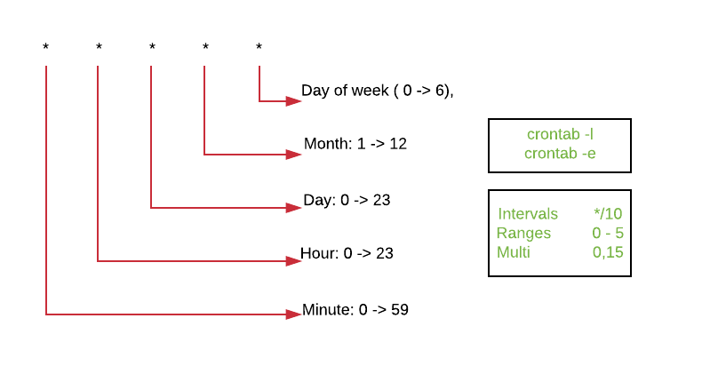
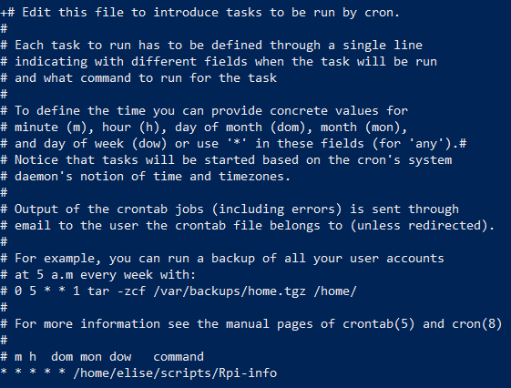

## Challenge 1: RPi Setup Script

**This is a bash script that takes care of the full SSH setup of your Raspberry Pi. It fetches your public keys from Github using curl.**

```sh
#!/usr/bin/env bash
cd ~/.ssh
curl https://github.com/desmetelise.keys >> ~/.ssh/authorized_keys
```

* cd: Change directory (~ is a shortcut to traverse to your home directory.)
* curl: Transfers data to or from a network server. 
* ">>": Redirects output to a file appending the redirected output at the end


## Challenge 2: RPi Detector

**This bash script  determines the IP addresses and MAC addresses of all the Raspberry Pi's currently on the network.**
```sh
#!/usr/bin/env bash
sudo tcpdump -n -e -l -vvv 'udp port 67 or udp port 68' | while read line; do
        if echo $line | grep "Client-Ethernet-Address" > /dev/null ; then
                mac=$(echo $line | grep "Client-Ethernet-Address" | awk ' {print $2} ')
        fi
        if echo $line | grep "Requested-IP Option" > /dev/null ; then
                ip=$(echo $line | grep "Requested-IP Option" | awk ' {print $6} ')
        fi
        if echo $line | grep "Hostname Option " > /dev/null ; then
                name=$(echo $line | grep "Hostname" | awk ' {print $6} ')
                echo $mac "=>" $ip "(" $name ")"
        fi
done
```

* sudo: Allows a user with proper permissions to execute a command as another user, such as the superuser.
* tcpdump: Package analyzer tool which is used to campture or filter TCP/IP pachets that received or transferred over a network on a specific interface.
  * -n option: Don't convert addressess to names.
  * -e option: Print the link-level header on each dump line.
  * -l option: Output line by line, allowing usage of pipes
  * -vvv option: Verbose mode, this provides additional details.
  * 'udp port 67 or udp port 68': monitor traffic on port 67 and 68.
* while read line: Read file line by line
* if loops: If the line contains the given text then it will define a variable with the info we want.
  * grep: (global reqular expression print) Processes text line by line and prints any lines which match a specified pattern.
  * ">": Redirects output to a file, overwriting the file.
  * awk ' {print $1} ': Takes the first word of the line.
  * echo: print line of text.

  

## Challenge 3: Posten to API

**Next the gathered information is posted to the api of my-devices.**


```sh
#!/usr/bin/env bash
sudo tcpdump -n -e -l -vvv 'udp port 67 or udp port 68' | while read line; do
        if echo $line | grep "Client-Ethernet-Address" > /dev/null ; then
                mac=$(echo $line | grep "Client-Ethernet-Address" | awk ' {print $2} ')
        fi
        if echo $line | grep "Requested-IP Option" > /dev/null ; then
                ip=$(echo $line | grep "Requested-IP Option" | awk ' {print $6} ')
        fi
        if echo $line | grep "Hostname Option " > /dev/null ; then
                name=$(echo $line | grep "Hostname" | awk ' {print $6} ')
                echo  $mac
                echo $ip
                echo $name
                JsonString=$(echo '{"time": "'$(date)'","update":{"mac":"'$mac'","ip_address":"'$ip'", "name":'$name'}}' | jq .)
                curl --header "Content-Type: application/json" \
                --request POST \
                --data "$JsonString" \
                http://mydevices.labict.xyz/updates.json
        fi
done
```

* jq: command-line JSON processor.
* curl: Transfers data to or from a network server. 
  * --header: Extra header to use when getting a web page.
  * --request: The request method to use.
  * --data: Send specified data in POST request.

Public API can be found [here](http://mydevices.labict.xyz/updates)

  
  

 ## Challenge 4: Extra Pi info

**Next a cronjob that updates some stats of the pi is created.**

```sh
#!/usr/bin/env bash
mac=$(cat /sys/class/net/eth0/address)
uptime=$(uptime -p)
hostname=$(cat /proc/sys/kernel/hostname)
kernel=$(uname -r)
freeDisk=$(df / -h | grep /dev/root | awk ' {print $4} ')
totalDisk=$(df / -h | grep /dev/root | awk ' {print $2} ')
freeMem=$(free -m -h| grep Mem | awk ' {print $4} ')
totalMem=$(free -m -h| grep Mem | awk ' {print $2} ')
JsonString=$(echo '{"stat":{"mac":"'$mac'","disk": {"free": "'$freeDisk'", "total": "'$totalDisk'"}, "memory":{"free":"'$freeMem'","total":"'$totalMem'"},"hostname": "'$hostname'","uptime":"'$uptime'","kernel": "'$kernel'"}}')
echo $JsonString | jq .
curl --header "Content-Type: application/json" \
                --request POST \
                --data "$JsonString" \
                http://mydevices.labict.xyz/stats.json
touch /tmp/done.txt
```
Public API can be found [here](http://mydevices.labict.xyz/stats)

 



Some information about Cronjobs:
 
 

