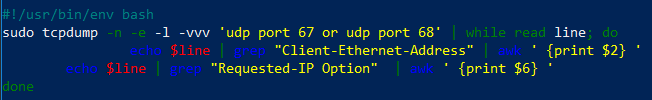

## Challenge 1: RPi Setup Script

**Create a bash script that takes care of the full SSH setup of your Raspberry Pi. Fetch your public keys from Github using curl or a similar tool.**

```sh
#!/usr/bin/env bash
cd ~/.ssh
if [ ! -e authorized_keys ]; then
curl https://github.com/desmetelise.keys >> authorized_keys
else
echo "Authorized_key is already present."
fi
```

## Challenge 2: RPi Detector

**Create a bash script that determines the IP addresses and MAC addresses of all the Raspberry Pi's currently on the network.**

```sh
#!/usr/bin/env bash
sudo tcpdump -n -e -l -vvv 'udp port 67 or udp port 68' | while read line; do
        if echo $line | grep "Client-Ethernet-Address" > /dev/null ; then
                mac=$(echo $line | grep "Client-Ethernet-Address" | awk ' {print $2} ')
        fi
        if echo $line | grep "Hostname Option " > /dev/null ; then
                name=$(echo $line | grep "Hostname" | awk ' {print $6} ')
        fi
        if echo $line | grep "Requested-IP Option" > /dev/null ; then
                ip=$(echo $line | grep "Requested-IP Option" | awk ' {print $6} ')
                echo  $mac
                echo $ip
                echo $name
        fi
done
```

 
