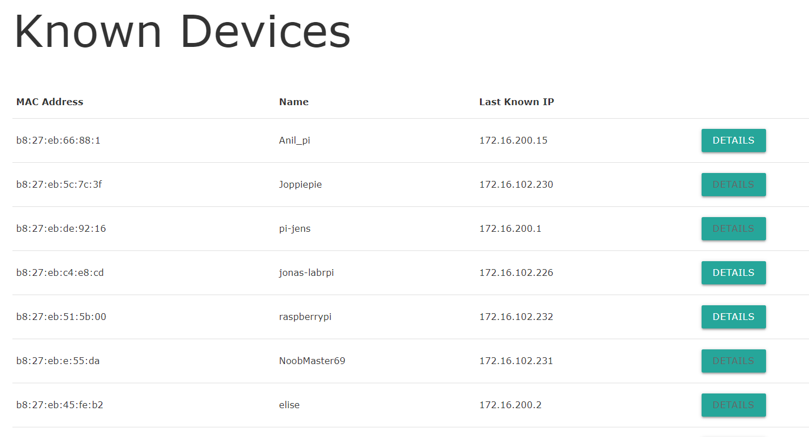
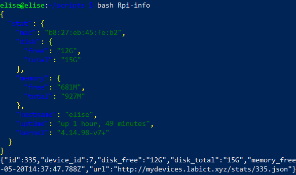

## Challenge 1: RPi Setup Script

**Create a bash script that takes care of the full SSH setup of your Raspberry Pi. Fetch your public keys from Github using curl or a similar tool.**

```sh
#!/usr/bin/env bash
cd ~/.ssh
curl https://github.com/desmetelise.keys >> ~/.ssh/authorized_keys
```

## Challenge 2: RPi Detector

**Create a bash script that determines the IP addresses and MAC addresses of all the Raspberry Pi's currently on the network.**
```sh
#!/usr/bin/env bash
sudo tcpdump -n -e -l -vvv 'udp port 67 or udp port 68' | while read line; do
        if echo $line | grep "Client-Ethernet-Address" > /dev/null ; then
                mac=$(echo $line | grep "Client-Ethernet-Address" | awk ' {print $2} ')
        fi
        if echo $line | grep "Requested-IP Option" > /dev/null ; then
                ip=$(echo $line | grep "Requested-IP Option" | awk ' {print $6} ')
        fi
        if echo $line | grep "Hostname Option " > /dev/null ; then
                name=$(echo $line | grep "Hostname" | awk ' {print $6} ')
                echo $mac "=>" $ip "(" $name ")"
        fi
done
```
  

## Challenge 3: Posten to API

**Next the gathered information should be posted to the api of my-devices.**


```sh
#!/usr/bin/env bash
sudo tcpdump -n -e -l -vvv 'udp port 67 or udp port 68' | while read line; do
        if echo $line | grep "Client-Ethernet-Address" > /dev/null ; then
                mac=$(echo $line | grep "Client-Ethernet-Address" | awk ' {print $2} ')
        fi
        if echo $line | grep "Requested-IP Option" > /dev/null ; then
                ip=$(echo $line | grep "Requested-IP Option" | awk ' {print $6} ')
        fi
        if echo $line | grep "Hostname Option " > /dev/null ; then
                name=$(echo $line | grep "Hostname" | awk ' {print $6} ')
                echo  $mac
                echo $ip
                echo $name
                JsonString=$(echo '{"time": "'$(date)'","update":{"mac":"'$mac'","ip_address":"'$ip'", "name":'$name'}}' | jq .)
                curl --header "Content-Type: application/json" \
                --request POST \
                --data "$JsonString" \
                http://mydevices.labict.xyz/updates.json
        fi
done
```
  
  

 ## Challenge 4: Extra Pi info

**Next create a cronjob that updates some stats of the pi. Choose a useful time schedule yourself.**

```sh
#!/usr/bin/env bash
mac=$(cat /sys/class/net/eth0/address)
uptime=$(uptime -p)
hostname=$(cat /proc/sys/kernel/hostname)
kernel=$(uname -r)
freeDisk=$(df / -h | grep /dev/root | awk ' {print $3} ')
freeDisk=$(df / -h | grep /dev/root | awk ' {print $2} ')
freeMem=$(free -m -h| grep Mem | awk ' {print $4} ')
totalMem=$(free -m -h| grep Mem | awk ' {print $2} ')
JsonString=$(echo '{"stats":{"mac":"'$mac'","disk": {"free": "'$freeDisk'", "total": "'totalDisk'"}, "memory":{"free$echo $JsonString | jq .
```
 
 