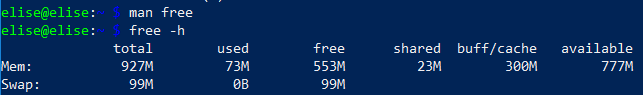

## Challenge 1: The dmesg command

**What does the dmesg command do? Check the man pages.**

man dmesg

dmesg is used to examine or control the kernel ring buffer.

The default action is to display all messages from the kernel ring buffer.

## Challenge 2: The free command

**The free command shows the system memory usage. How can you make the numbers "human readable"?**

man free

free -h

## Challenge 3: Number of Cores

**Use grep on the file /proc/cpuinfo to get the number of CPU cores. The output can simple be the number of cores (including logical cores).**

