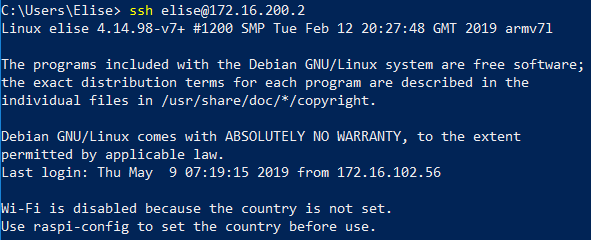
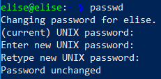
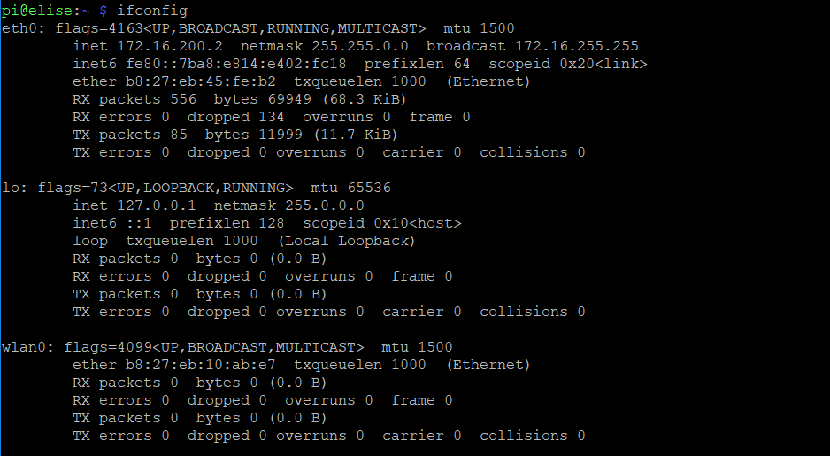

## Challenge 1: Build an operational Raspbian system

**Start by creating an SD card with Raspbian Stretch Lite.**

**Connect to your Raspberry Pi via SSH**

**Update the system and change the password of the pi user.**

**Search the Internet on how to change the hostname of the device. Give it a sensible name.**

