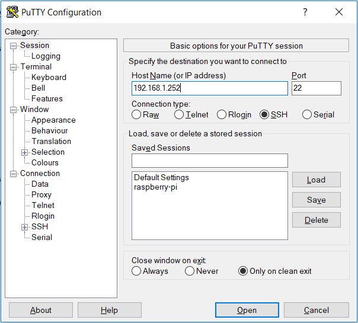

## Challenge 1: Build an operational Raspbian system

**Start by creating an SD card with Raspbian Stretch Lite.**
To download Raspbian Stretch Lite go to:
[Raspbian Stretch Lite](https://www.raspberrypi.org/downloads/raspbian/)

You need to flash you SD card and put the Raspbian Stretch Lite image on it.
When the flashing is done, add a .txt file to boot map (on the SD card). Rename this file to `ssh`.

**Connect to your Raspberry Pi via SSH**



**Update the system and change the password of the pi user.**
Update:
```
sudo apt update
sodo apt upgrade
```
Change password:
```
passwd
```


**Search the Internet on how to change the hostname of the device. Give it a sensible name.**

Change hostname:
```
sudo nano /etc/hostname
sudo nano /etc/hosts
```
